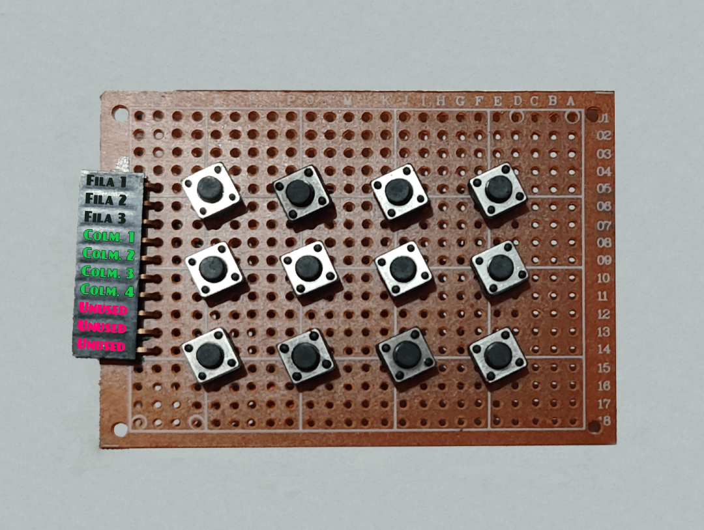
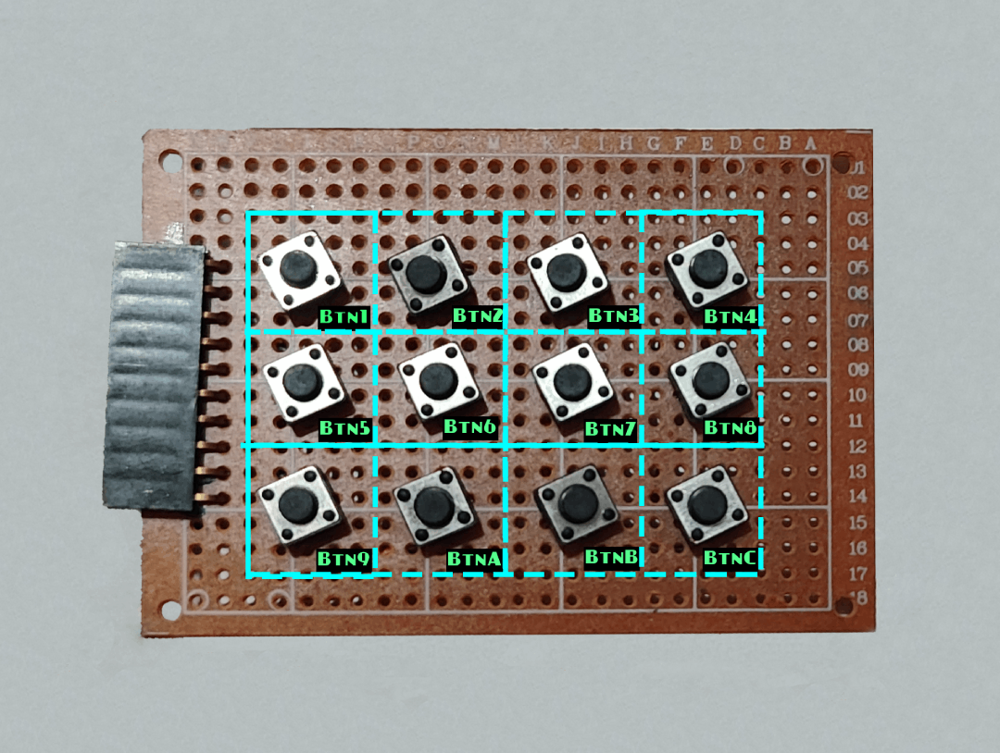

# MoniAux


MoniAux es un sistema embebido basado en ESP32-S3 que integra una pantalla TFT, entrada mediante teclado matricial y encoder rotativo, y conectividad WiFi para sincronización horaria y actualizaciones OTA. Está diseñado como una plataforma de monitoreo y control con interfaz visual y entrada física, ideal para proyectos de automatización o interacción hombre-máquina.

> [!IMPORTANT]
> Este proyecto, si se desea usar los comandos de botones y encoder con sus debidos accesos directos, sincronización de texto, customscreens, etc., requiere que se use su aplicacion MoniAuxServer, la cual se encuentra en el repositorio [MoniAuxServer](https://github.com/JGomezC145/MoniAuxServer/).  

## Características principales

- Pantalla TFT a color (128x128) con interfaz SPI
- Indicadores visuales de estado para conexión Serial y WiFi
- Sincronización horaria automática mediante NTP
- Control LED RGB con comandos dinámicos
- Entrada por teclado 3x4 y encoder rotativo (giro y pulsación)
- Comunicación por comandos serie
- Conectividad WiFi con selección de red y reconexión automática
- Actualizaciones OTA mediante ArduinoOTA

## Pines

### Pantalla TFT (SPI2 en ESP32-S3)

```cpp
#define TFT_SCLK 6   // Clock SPI - SCL
#define TFT_MOSI 4   // MOSI SPI - SDA
#define TFT_MISO -1  // No se usa
#define TFT_CS   7   // Chip Select
#define TFT_DC   2   // Data/Command
#define TFT_RST  3   // Reset
```

Por tanto, esta tabla de pines se conecta a los siguientes GPIOs del ESP32-S3:
| Pin | GPIO | Descripción |
|-----|------|-------------|
| SCLK | 6    | Clock SPI (SCL) |
| MOSI | 4    | Data SPI (SDA) |
| MISO | -1   | No se usa |
| CS   | 7    | Chip Select |
| DC   | 2    | Data/Command |
| RST  | 3    | Reset |
| VCC | 3V3   | Alimentación |
| GND | GND  | Tierra |
| BLK | 3V3   | Iluminación de la pantalla |


### Interfaz Fisica (HID)

#### Teclado 3x4 (matricial)
Distribuido en 3 filas y 4 columnas, con los siguientes pines:




```cpp
byte rowPins[ROWS] = { 10, 11, 12 };     // Filas conectadas a GPIOs
byte colPins[COLS] = { 13, 14, 15, 16 }; // Columnas conectadas a GPIOs
```


Distribución de teclas y comandos:

```cpp
char keys[ROWS][COLS] = {
    { '1','2','3','4' },
    { '5','6','7','8' },
    { '9','A','B','C' }
};
```

De tal modo que los comandos de cada tecla son:


#### Encoder rotativo
```cpp
constexpr gpio_num_t ENC_A = GPIO_NUM_18;
constexpr gpio_num_t ENC_B = GPIO_NUM_17;
constexpr gpio_num_t ENC_SW= GPIO_NUM_9;
```

Por tanto, esta tabla de pines se conecta a los siguientes GPIOs del ESP32-S3 a la interfaz física (HID):
| Pin | GPIO | Descripción |
|-----|------|-------------|
| R1  | 10   | Fila 1      |
| R2  | 11   | Fila 2      |
| R3  | 12   | Fila 3      |
| C1  | 13   | Columna 1   |
| C2  | 14   | Columna 2   |
| C3  | 15   | Columna 3   |
| C4  | 16   | Columna 4   |
| CLK | 18   | Entrada A del encoder |
| DT | 17   | Entrada B del encoder |
| SW| 9    | Pulsación del botón del encoder |
| VCC | 3V3  | Alimentación del encoder |
| GND | GND  | Tierra del encoder |

## Comandos de eventos enviados por Serial

|Evento|Descripción|Comando enviado por MoniAux|
|------|-----------|---------------------------|
| Click botón 1| Pulsación del botón 1 del teclado | `Btn1` |
| Click botón 2| Pulsación del botón 2 del teclado | `Btn2` |
| Click botón 3| Pulsación del botón 3 del teclado | `Btn3` |
| Click botón 4| Pulsación del botón 4 del teclado | `Btn4` |
| Click botón 5| Pulsación del botón 5 del teclado | `Btn5` |
| Click botón 6| Pulsación del botón 6 del teclado | `Btn6` |
| Click botón 7| Pulsación del botón 7 del teclado | `Btn7` |
| Click botón 8| Pulsación del botón 8 del teclado | `Btn8` |
| Click botón 9| Pulsación del botón 9 del teclado | `Btn9` |
| Click botón A| Pulsación del botón A del teclado | `BtnA` |
| Click botón B| Pulsación del botón B del teclado | `BtnB` |
| Click botón C| Pulsación del botón C del teclado | `BtnC` |
| Giro a la izquierda| Giro del encoder hacia la izquierda | `EncoderL` |
| Giro a la derecha| Giro del encoder hacia la derecha | `EncoderR` |
| Pulsación del encoder| Pulsación del botón del encoder | `EncoderSW` |

## Estructura del proyecto

```
MoniAux/
├── include/
│   ├── mainConfig.h       // Configuración general
│   ├── secret.h           // (definir credenciales WiFi)
│   ├── input.h            // Definición de entrada y eventos
│   ├── display.h          // Interfaz gráfica y control de pantalla
│   ├── wifi_ota.h         // Conexión WiFi y soporte OTA
│   ├── serial_comm.h      // Comunicación Serial y comandos
│   ├── credentials.h      // Definición de ssid y password
│   ├── globals.h          // Variables globales como hora actual
├── src/
│   ├── main.cpp           // Punto de entrada
│   ├── display.cpp        // Interfaz gráfica y control de pantalla
│   ├── wifi_ota.cpp       // Conexión WiFi y soporte OTA
│   ├── serial_comm.cpp    // Comunicación Serial y comandos
│   ├── input.cpp          // Lectura del keypad y encoder
│   ├── credentials.cpp    // Definición de ssid y password
│   ├── globals.cpp        // Variables globales como hora actual
├── platformio.ini        // Configuración de PlatformIO
└── README.md
```

## Requisitos

* Placa ESP32-S3 (compatible con SPI y entrada digital)
* Pantalla TFT 128x128 con controlador ST7735
* Teclado matricial 3x4
* Encoder rotativo con botón
* Entorno de desarrollo Arduino o PlatformIO
* Librerías:

  * Adafruit\_ST7735
  * Keypad
  * WiFi
  * ArduinoOTA
  * NTPClient
  * Librerías nativas de ESP32 (SPI, GPIO)

## Configuración y despliegue

1. Configurar las credenciales WiFi en `include/secret.h` o directamente en `credentials.cpp`
2. Compilar y cargar el firmware a la placa
3. Conectar el dispositivo, iniciará mostrando pantalla de arranque
4. Usar el monitor serial para enviar comandos o interactuar con el sistema

## Comandos disponibles por Serial

> [!WARNING]
> Estos comandos se usan con fines debug y control de dispositivo. Su uso no afecta variables de internas.

> [!NOTE]
> Adicionalmente, existen 3 comandos de estado los cuales son `UpdatePropsTitle:<Titulo>`, `UpdatePropsArtist:<Artista>`, `UpdateState:<State>`; y un comando de awake `imhere`, sin embargo, estos comandos están en fase de prueba y su integración actual es nula.

* `comm:scan` — Escanea redes WiFi cercanas
* `comm:conwf <SSID>;<PASS>` — Conecta a red WiFi específica
* `comm:diswf` — Desconecta del WiFi actual
* `comm:wfstat` — Muestra información detallada del estado WiFi
* `comm:restart` — Reinicia el dispositivo
* `comm:clearScreen` — Limpia completamente la pantalla
* `comm:setRGB:<R>,<G>,<B>[,<bright>]` — Cambia el color del LED RGB (brillo opcional)
* `comm:forceUpdateTime` — Actualiza la hora desde el servidor NTP
* `settime:<HH:MM>` — Ajusta manualmente la hora

## Entrada física

* Teclado 3x4 que registra caracteres: 1–9, A, B, C
* Encoder rotativo que detecta:

  * Giro a la izquierda
  * Giro a la derecha
  * Pulsación del botón central

## Salida visual

* Interfaz gráfica con:

  * Hora actual actualizada automáticamente
  * Indicadores de estado para WiFi y Serial
  * Dirección IP local al conectar WiFi
  * Mensajes de respuesta a eventos del usuario
  * Progreso visual durante actualizaciones OTA

## OTA (Over-the-Air)

El dispositivo soporta actualizaciones de firmware vía WiFi con ArduinoOTA. Una vez conectado:

* La pantalla muestra el inicio del proceso
* Se visualiza el porcentaje de progreso
* El sistema se reinicia automáticamente al finalizar la actualización

## Seguridad

Las credenciales WiFi deben mantenerse fuera del repositorio mediante un archivo `secret.h` no versionado, o definidas directamente en `credentials.cpp` para pruebas locales.

## Licencia


> [!WARNING]
> Este repositorio ha sido clonado desde JGomezC145/esp32-moniaux, que el mismo es privado. Por temas control, se prefiere crear un nuevo repositorio publico, y no cambiar la visibilidad del repositorio original. Este repositorio y su código es original y propio. 👍
